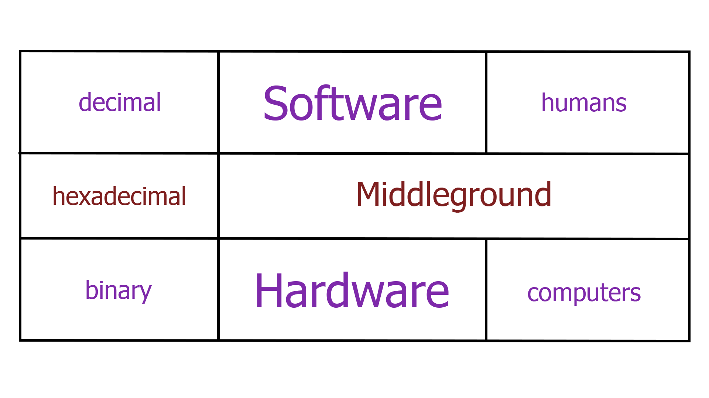
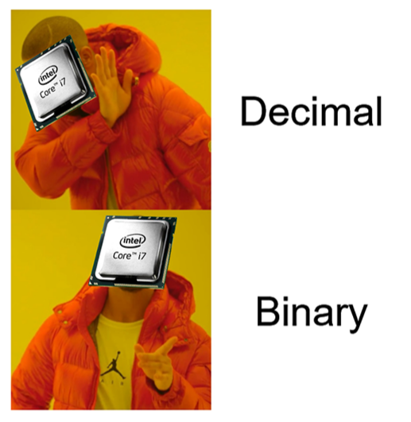
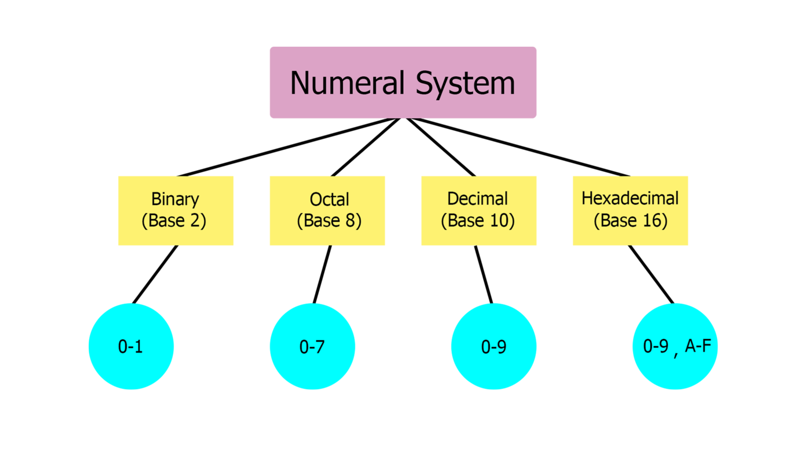

# Data Formats

## Numeral Systems

Numeral Systems are a method of representing numbers by mathematical combinations of symbols.



Humans prefer the `decimal` numeral system (also know as Base-10), since it provides better readability.
Therefore, written software (i.e. code) is mostly `Base-10`, as humans write software far more than they build hardware.

Computers, on the other hand, use binary (or Base-2), the numerical system that uses two digits (0 and 1), which are also known as `bits` and `bytes` (1 byte = 8 bits)



But why?
Hardware prefers them, since they are associated easier with electrical signals:


Of course, there is also an in-between: Hexadecimal.
Also known as Base-16, it uses 10 digits (0-9) and 6 alphabet letters (A-F).
Hexadecimal data is both readable and tightly correlated to the binary representation.
Let's say we have `0b10101001` (`10101001`).
I assume you can safely say that since we have 8 bits, it will be `< 256`.
Its hexadecimal form is `0xa9` (`a9`).
Thus, if we want to convert it to `decimal`, instead of doing 8 steps:

$(1 × 2^7) + (0 × 2^6) + (1 × 2^5) + (0 × 2^4) + (1 × 2^3) + (0 × 2^2) + (0 × 2^1) + (1 × 2^0) = 169$

we only do 2 steps:

$(a × 16^1) + (9 × 16^0) = 169$

Some conversions:

```py
# binary <――> decimal
def binToDec(n):
    return int(n,2)

def decToBin(n):
    return bin(n)

# hexadecimal <――> decimal
def hexToDec(n):
    return int(n, 16)

def decToHex(n):
    return hex(n)

# binary <――> hexadecimal
def binToHex(n):
    return(decToHex(binToDec(n)))

def hexToBin(n):
    return(decToBin(hexToDec(n)))

# Back and forth conversions
if __name__ == '__main__':
    print(f"0b1111 ―――> {binToDec('0b1111')}")
    print(f"15 ―――> {decToBin(15)}")

    print(f"0xa9 ―――> {hexToDec('0xa9')}")
    print(f"169 ―――> {decToHex(169)}")

    print(f"0b111101111011 ―――> {binToHex('0b111101111011')}")
    print(f"0xf7b ―――> {hexToBin('0xf7b')}")
```

And their output:

```text
0b1111 ―――> 15
15 ―――> 0b1111
0xa9 ―――> 169
169 ―――> 0xa9
0b111101111011 ―――> 0xf7b
0xf7b ―――> 0b111101111011
```

### Octal

Octal or Base-8 uses 8 digits (0-7).
It is the least popular of the aforementioned 4, but an interesting use of it is in the Unix File Permissions system:

Here is a table that shows what each permissions does on a file, respectively on a directory.


Each file/directory has three sets of permissions:
`Owner`,
`Group Owner`,
`Others`

So, if we want to view the permissions of a file/directory we execute:

```bash
root@kali:~# ls -l File_Name
-rwxrw-r-- 1 root root 1000 Sep 10 2020 File_Name
-[-][-][-]   [--] [--]
| |  |  |     ||   ||
| |  |  |     ||   ||
| |  |  |     ||   ++----------------> 6. Group
| |  |  |     ++---------------------> 5. Owner
| |  |  +----------------------------> 4. Others Permissions
| |  +-------------------------------> 3. Group Permissions
| +----------------------------------> 2. Owner Permissions
+------------------------------------> 1. File Type
```


An overview of the presented `Numeral Systems`:

