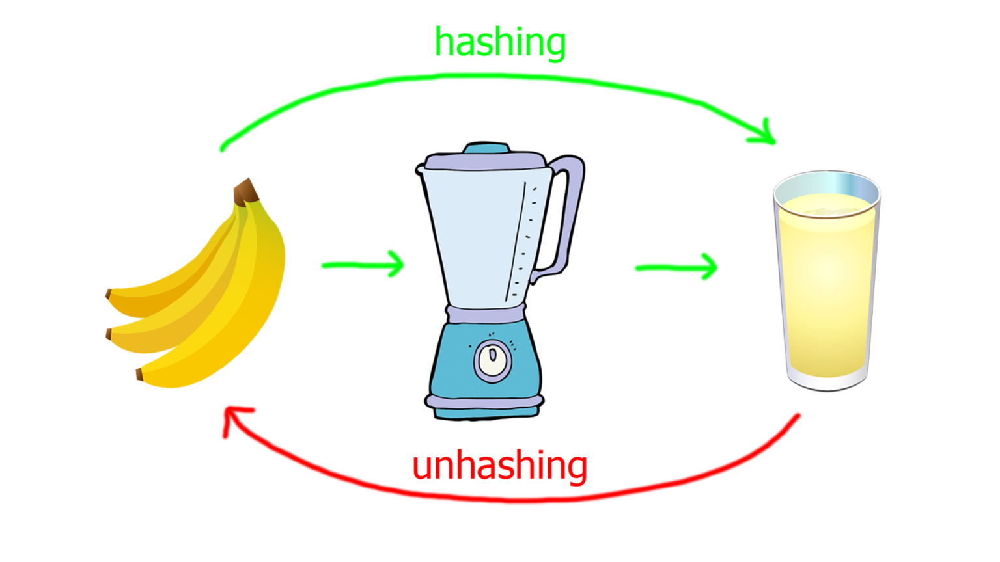

# Hashing

A good way to compress data is represented by hashing.
Data can be stored in hashes; hashes can be stored in hash tables, thus enabling quicker data lookup.

But how does it work?

A hashing algorithm is a mathematical algorithm that converts an input data array of a certain type and arbitrary length to an output bit string of a fixed length.
The process is one-way, as you cannot convert a hash back to the original data, like making a banana smoothie, as seen in the image below:



As you can see, you cannot make a banana back from the juice, so `unhashing` is impossible.

Hashes establish identity between inputs because they are unique.
We can safely assume that if 2 inputs have the same hash, they are identical.

We can also use hashes for data encryption.
We can find the hash of a some data in a lot of ways. Some of them are:

Getting the hash (`md5` in this case) of a text using `Bash`

```bash
root@kali:~$ echo -n "Random plaintext" | md5sum
1155bd70728d5dc0e1856f7742621d94  -
```

We can see that by adding, changing or deleting a character from the text, radically changes the hash:

```bash
root@kali:~$ echo -n "Random plaintextt" | md5sum
43052701309339b0a084bfbe5a5e531c
root@kali:~$ echo -n "Random plaintest" | md5sum
29adfa240cda59153245464ed8de4ec1
root@kali:~$ echo -n "Random plaintex" | md5sum
d992ee83f3675b4021e0bb614021ffeb
```

Getting the hash (`sha-1` in this case) of a text using `Python`:

We will use the module `hashlib` in order to get hashes in Python:

```py
import hashlib

text = "some kind of text"
h = hashlib.sha1(text.encode('ascii'))

print(h.hexdigest())
```

This code would provide the following `sha-1` hash:

```text
1145d8b71c84d1b0a717d36bd0cd6638697bd606
```

We can store passwords as MD5, SHA-1 or SHA-2 (most popular ones), so that in case of a security breach, the real passwords are still hidden.
An unsecure and naive way of storing passwords is:

```text
|  User   |      Password      |
|:-------:|:------------------:|
| Robert  | S3cur3.p@ssw0rd?   |
| Maria   | Palmademallorca123 |
| Ciprian | password           |
```

A much better approach is to store the passwords hashed, as mentioned above:

```text
|  User   |             Password             |
|:-------:|:--------------------------------:|
| Robert  | 0daeb943b4cc762da2c541c7338c90b6 |
| Maria   | 9daa2547b9a0155841d7f653257e3762 |
| Ciprian | 5f4dcc3b5aa765d61d8327deb882cf99 |
```
